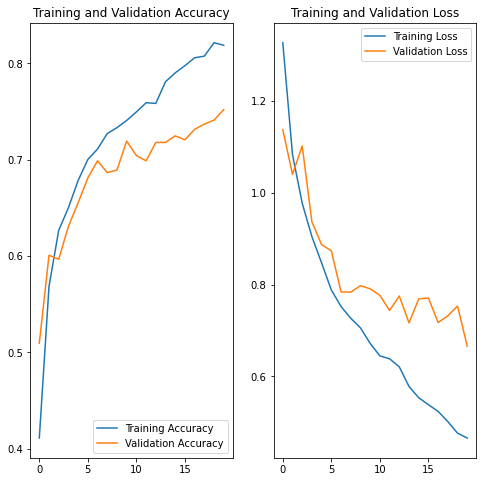

# Homework 3

> 2018000337
> 컴퓨터소프트웨어학부
> 장호우

## Analysis

Trough analyzing high-level(고급) and basic(기본) code, there are a little difference in them.

Put simply, there are three parts of difference, data augmentation, model architecture and evaluation results(it is not a differece essentially).

Thus, I modify the some code to decide data augmentation is turned on or not. Second, to change the model architecture. Last, to show the evaluation results when precessing of training in each epoch.

## Experiment Code

The experiment code on my github, click [here](https://github.com/noahzhy/ITC4009/blob/main/hw3/exchange.py).

The original evaluation of the two network models, results are as same as website(tensorflow official).

### Official 기본 (fashion dataset)


### Official 고급 (flower dataset)



## Experiments

### E-01

```python
    # E-01
    image_size = (180, 180)
    inputs = (180, 180, 3)
    outputs = 5

    train_ds, test_ds = loading_flower_dataset()
    # basic model architecture, without data augmentation
    results = train(train_ds, test_ds, False, inputs, outputs, "fashion", epochs)

    visualize_results(results)
```

#### Experiment Results


### E-02

```python
    # E-02
    image_size = (28, 28)
    inputs = (28, 28, 1)
    outputs = 10
    # high-level model architecture with data augmentation
    train_ds, test_ds = loading_fashion_dataset()
    results = train(train_ds, test_ds, True, inputs, outputs, "flower", epochs)
```

Accuracy of validation only get **0.4550** % at best.

#### Experiment Results


Accuracy of validation get **0.8906** % at best, in additon, there was not overfitting within 20 training epochs.

## Review

```python
    data_aug = keras.Sequential(
        [
            layers.experimental.preprocessing.RandomFlip("horizontal"),
            layers.experimental.preprocessing.RandomRotation(0.1),
            layers.experimental.preprocessing.RandomZoom(0.1),
        ]
    )
```

The code above is about data augmentation, It was the first time I knew the data augmentation precessing could be added as layers in model.

Before that, I usually used the method as following.

```python
data_gen = ImageDataGenerator(
    featurewise_center=True,
    featurewise_std_normalization=True,
    rotation_range=20,
    width_shift_range=0.2,
    height_shift_range=0.2,
    horizontal_flip=True,
    ...
)

train_generator = data_gen.flow_from_directory(
    data_path,
    batch_size=128,
    class_mode='categorical',
    target_size=(224, 224),
    color_mode='rgb',
    ...
)
```

I modify some code to show the validation results when training in each epoch.

```python
def loading_fashion_dataset():
    fashion_mnist = keras.datasets.fashion_mnist
    (x_train, y_train), (x_test, y_test) = fashion_mnist.load_data()

    x_train = (np.expand_dims(x_train, -1))
    x_test = (np.expand_dims(x_test, -1))

    train_ds = ImageDataGenerator().flow(x_train, y_train, batch_size=32)
    val_ds = ImageDataGenerator().flow(x_test, y_test, batch_size=32)

    return train_ds, val_ds

    ...

    history = model.fit(
        train_ds,
        validation_data=val_ds,
        epochs=epochs
    )
```

## Difficult Point

There are no hard parts on official website, but it's a little difficult when training the model on my laptop without GPU. And also compatibility issues between CUDA and tensorflow.

## All Code

```python
import os
import PIL
import pathlib
import numpy as np
import tensorflow as tf
import matplotlib.pyplot as plt

from tensorflow import keras
from tensorflow.keras import layers
from tensorflow.keras.models import Sequential
from keras.preprocessing.image import ImageDataGenerator


def visualize_results(history):
    acc = history.history['accuracy']
    val_acc = history.history['val_accuracy']

    loss = history.history['loss']
    val_loss = history.history['val_loss']

    epochs_range = range(epochs)

    plt.figure(figsize=(8, 8))
    plt.subplot(1, 2, 1)
    plt.plot(epochs_range, acc, label='Training Accuracy')
    plt.plot(epochs_range, val_acc, label='Validation Accuracy')
    plt.legend(loc='lower right')
    plt.title('Training and Validation Accuracy')

    plt.subplot(1, 2, 2)
    plt.plot(epochs_range, loss, label='Training Loss')
    plt.plot(epochs_range, val_loss, label='Validation Loss')
    plt.legend(loc='upper right')
    plt.title('Training and Validation Loss')
    plt.show()


def loading_flower_dataset():
    dataset_url = "https://storage.googleapis.com/download.tensorflow.org/example_images/flower_photos.tgz"
    data_dir = tf.keras.utils.get_file(
        'flower_photos', origin=dataset_url, untar=True)
    data_dir = pathlib.Path(data_dir)

    train_ds = tf.keras.preprocessing.image_dataset_from_directory(
        data_dir,
        validation_split=validation_split,
        subset="training",
        seed=seed,
        image_size=image_size,
        batch_size=batch_size
    )
    val_ds = tf.keras.preprocessing.image_dataset_from_directory(
        data_dir,
        validation_split=validation_split,
        subset="validation",
        seed=seed,
        image_size=image_size,
        batch_size=batch_size
    )

    AUTOTUNE = tf.data.AUTOTUNE
    train_ds = train_ds.cache().shuffle(1000).prefetch(buffer_size=AUTOTUNE)
    val_ds = val_ds.cache().prefetch(buffer_size=AUTOTUNE)

    return train_ds, val_ds


def loading_fashion_dataset():
    fashion_mnist = keras.datasets.fashion_mnist
    (x_train, y_train), (x_test, y_test) = fashion_mnist.load_data()

    x_train = (np.expand_dims(x_train, -1))
    x_test = (np.expand_dims(x_test, -1))

    train_ds = ImageDataGenerator().flow(
        x_train, y_train, batch_size=32
    )
    val_ds = ImageDataGenerator().flow(
        x_test, y_test, batch_size=32
    )

    return train_ds, val_ds


def train(train_ds, val_ds, data_aug, inputs, outputs, models, epochs):
    data_aug = keras.Sequential(
        [
            layers.experimental.preprocessing.RandomFlip("horizontal"),
            layers.experimental.preprocessing.RandomRotation(0.1),
            layers.experimental.preprocessing.RandomZoom(0.1),
        ]
    )

    model = Sequential()
    model.add(layers.Input(shape=inputs))

    if data_aug:
        model.add(data_aug)

    model.add(layers.experimental.preprocessing.Rescaling(1./255))

    if models == "flower":
        model.add(layers.Conv2D(16, 3, padding='same', activation='relu'))
        model.add(layers.MaxPooling2D())
        model.add(layers.Conv2D(32, 3, padding='same', activation='relu'))
        model.add(layers.MaxPooling2D())
        model.add(layers.Conv2D(64, 3, padding='same', activation='relu'))
        model.add(layers.MaxPooling2D())
        model.add(layers.Dropout(0.2))
        model.add(layers.Flatten())
        model.add(layers.Dense(128, activation='relu'))

    elif models == "fashion":
        model.add(layers.Flatten())
        model.add(layers.Dense(128, activation='relu'))

    model.add(layers.Dense(outputs))
    model.compile(
        optimizer='adam',
        loss=tf.keras.losses.SparseCategoricalCrossentropy(from_logits=True),
        metrics=['accuracy']
    )
    model.summary()

    history = model.fit(
        train_ds,
        validation_data=val_ds,
        epochs=epochs
    )

    return history


if __name__ == "__main__":
    batch_size = 32
    validation_split = 0.2
    epochs = 20
    seed = 123

    # E-01
    image_size = (180, 180)
    inputs = (180, 180, 3)
    outputs = 5

    train_ds, test_ds = loading_flower_dataset()
    # basic model architecture, without data augmentation
    results = train(train_ds, test_ds, False, inputs, outputs, "fashion", epochs)

    visualize_results(results)

    # E-02
    image_size = (28, 28)
    inputs = (28, 28, 1)
    outputs = 10
    # high-level model architecture with data augmentation
    train_ds, test_ds = loading_fashion_dataset()
    results = train(train_ds, test_ds, True, inputs, outputs, "flower", epochs)

    visualize_results(results)

```
