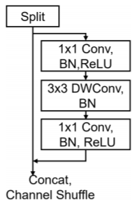

# Image classification in embedded device

> 2018000337
> 컴퓨터소프트웨어학부
> 장호우

## Abstract

This project mainly discusses related problem of image classification in embedded device through some simple tasks to discuss them. It includes two parts:

1. The effect of using only one channel of RGB channels to replace the grayscale image as input.

2. The latency of some representative blocks in embedded device.

## Introduction

The traditional neural network, mAP, FLOPs and other evaluation indicators are not suitable for mobile devices or embedded devices in the actual project deployment. Mobile devices or embedded devices have limited clock rate and memory, and come with accelerated hardware for tasks in deep learning. These limitations are often overlooked, thus this project focuses on the deployment of some neural networks on mobile devices or embedded devices.

In the first topic, because of memory limitations in many embedded devices. If using RGB channel, it will open at least (width x height x channels x type of data) memory space. In addition, the clock rate of many embedded devices is around 200 MHz. Even converting an RGB image to a grayscale image is a huge drain on computing power (detail in Appendix I). Therefore, if one channel in RGB channels can be directly used for the input of neural network via a memory pointer, it will greatly improve the efficiency of embedded device without the step of RGB to grayscale in deep learning. This topic discusses the effect of a single channel on recognition accuracy.

The embedded devices designed for deep learning is generally consist of a low clock rate CPU with a hardware acceleration devices such as VPU, TPU, etc.. In the second topic, it is mainly discuss the latency and efficiency of representative blocks on different acceleration hardware platforms.

## Dataset

The dataset in this project is `cifar10`.
* https://www.tensorflow.org/datasets/catalog/cifar10

## Methodology

In topic one, the same neural network(LeNet-5) was used but change the channel of inputs to test the effect of one single channel on the accuracy of image recognition.

It's based on LeNet-5, add BN and Dropout layer.

```python
def LeNet_5():
    model = Sequential()
    model.add(Conv2D(32,(5,5),strides=(1,1),input_shape=(32,32,1),padding='same',activation='relu'))
    model.add(BatchNormalization())
    model.add(MaxPooling2D(pool_size=(2,2)))
    model.add(Conv2D(64,(5,5),strides=(1,1),padding='same',activation='relu'))
    model.add(MaxPooling2D(pool_size=(2,2)))
    model.add(Flatten())
    model.add(Dense(128,activation='relu'))
    model.add(Dropout(0.5))
    model.add(Dense(10,activation='softmax'))
    return model
```

Modified the generator of dataset, thus we could choose generate only one channel in RGB images or convert to grayscale images.

```python
def dataset_generator(dataset, batch_size=256, num_classes=10, is_training=False, color_mode="grayscale"):
  images = np.zeros((batch_size, 32, 32, 1))
  labels = np.zeros((batch_size, num_classes))
  while True:
    count = 0 
    for sample in tfds.as_numpy(dataset):
      image = sample["image"]
      label = sample["label"]

      if color_mode == "grayscale":
        # rgb to grayscale
        image = cv.cvtColor(image, cv.COLOR_BGR2GRAY)
      else: # keep only one channel in RGB
        channel_index = list('BGR').index(color_mode.upper())
        image = image[:,:,channel_index]

      images[count%batch_size] = mobilenet_v2.preprocess_input(np.expand_dims(cv.resize(image, (32, 32)), -1))
      labels[count%batch_size] = np.expand_dims(to_categorical(label, num_classes=num_classes), 0)

      count += 1
      if (count%batch_size == 0):
        yield images, labels
```

In the 2nd topics, choose the representative blocks in MobileNet v2, shuffleNet v2, ResNet(residual block), SE Net. To changing the hardware platform to test performance of these blocks on the different hardware platform.

| Block  | ResNet V1                                                    | MobileNet V2 block                                           | ShuffleNet V2 block                                          |
| ------ | ------------------------------------------------------------ | ------------------------------------------------------------ | ------------------------------------------------------------ |
| Figure |  |  |  |

### ResNet(residual block)

```python
def residual_block(X, filters, stage, block):
    F1, F2, F3 = filters
    X_shortcut = X

    X = Conv2D(filters=F1, kernel_size=1, padding='valid')(X)
    X = BatchNormalization(axis=3)(X)
    X = Activation('relu')(X)

    X = Conv2D(filters=F2, kernel_size=3, padding='same')(X)
    X = BatchNormalization(axis=3)(X)
    X = Activation('relu')(X)

    X = Conv2D(filters=F3, kernel_size=1, padding='valid')(X)
    X = BatchNormalization(axis=3)(X)

    X = Add()([X, X_shortcut])
    X = Activation('relu')(X)
    return X
```

### MobileNet v2 block

```python
def mobilenet_block(inputs, out_channels, stride=1):
    x = conv_bn_relu(inputs, out_channels, kernel_size=1, relu="relu")
    x = DepthwiseConv2D(kernel_size=3, strides=stride, padding="same", use_bias=False)(x)
    x = bn_relu(x, relu=None)
    x = conv_bn_relu(x, out_channels, kernel_size=1, relu="relu")
    x = Add([inputs, x])
    return x

```

### shuffleNet block

```python
def channel_split(x, num_splits=2):
    return tf.split(x, axis=-1, num_or_size_splits=num_splits)

def shufflenet_block(X, out_channel):
    out_channel //= 2
    top, bottom = channel_split(X)

    top = conv_bn_relu(top, out_channel, kernel_size=1, relu="relu")
    top = DepthwiseConv2D(kernel_size=3, strides=stride, padding="same", use_bias=False)(x)
    top = bn_relu(x, relu=None)
    top = conv_bn_relu(x, out_channel, kernel_size=1, relu="relu")

    out = Concatenate()([top, bottom])
    out = channel_shuffle(out)
    return out
```

## Results

### I

| color_mode      | grayscale  | R    | G    | B    |
| --------------- | ---------- | ---- | ---- | ---- |
| val_accuracy(%) | 68.6       | 68.4 | 68.7 | 67.4 |

### II

Test on ImageNet dataset.

#### CPU

|             | ShuffleNet v2 | MobileNet v2 | ResNet v2 (50) |
| ----------- | ------------- | ------------ | -------------- |
| Accuracy(%) | 69.3          | 71.8         | 75.9           |
| Latency(ms) | 23            | 35           | 382            |

#### TPU

It's test on google edge computing hardware.

|             | ShuffleNet v2 | MobileNet v2 | ResNet v2 (50) |
| ----------- | ------------- | ------------ | -------------- |
| Accuracy(%) | 63.3          | 69.6         | 74.5           |
| Latency(ms) | 4             | 5            | 94             |

## Conclusion

Before I started this experiment, I thought that keeping only the Green channel would be the closest to the grayscale accuracy, since the RGB565 color format only has a 6 bit green channel. And through the simple image visualization is not difficult to see, the green channel is closer to the grayscale image.


From the results I, the recognition accuracy of green channel is higher than that of grayscale image. The guess is that the information redundancy of the other two color channels reduces the accuracy of the recognition.

Although the precision of ResNet with a large number of residual networks is higher than that of the other two structures, the latency is much higher than that of other networks. On devices with limited computing power, the Depthwise Conv2D layer is good for speed on embedded device platforms.

## Appendix

### Appendix I

The common code sample. Traversed each pixel of all channels and calculate the grayscale value.

```c++
typedef struct{
    int w, h, c;
    float *data;
} image;

image make_image(int w, int h, int c) {
    image out;
    out.h = h;
    out.w = w;
    out.c = c;
    out.data = calloc(h*w*c, sizeof(float));
    return out;
}

float get_pixel(image im, int x, int y, int c) {
    int index = ((im.h * im.w) * c) + (im.w * y) + x;
    return *(im.data + index);
}

void set_pixel(image im, int x, int y, int c, float v) {
    int index = ((im.h * im.w) * c) + (im.w * y) + x;
    *(im.data + index) = v;
    return;
}

image rgb_to_grayscale(image im) {
    assert(im.c == 3);
    image gray = make_image(im.w, im.h, 1);
    int i, j;
    for(i = 0; i < im.w; i++) {
        for(j = 0; j < im.h; j++) {
            float im_red = get_pixel(im, i, j, 0);
            float im_green = get_pixel(im, i, j, 1);
            float im_blue = get_pixel(im, i, j, 2);
            float grey_pixel = (0.299 * im_red) + (0.587 * im_green) + (0.114 * im_blue);
            set_pixel(gray, i, j, 0, grey_pixel);
        }
    }
    return gray;
}
```

### Appendix II

Project related code on my github.
* https://github.com/noahzhy/ITC4009/tree/main/project
